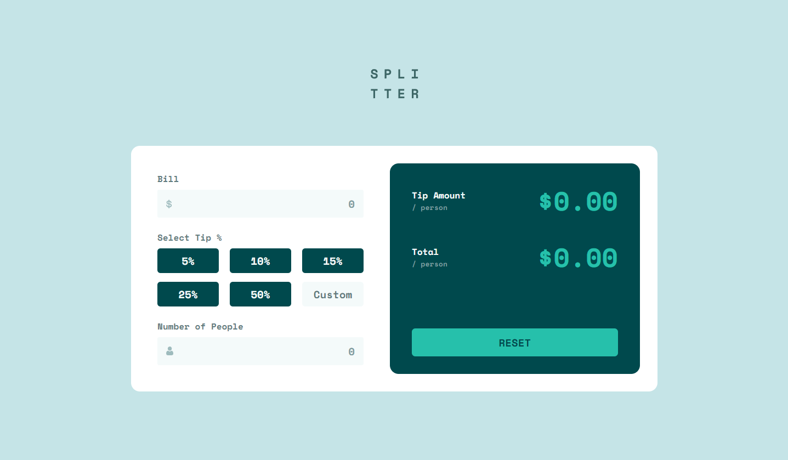
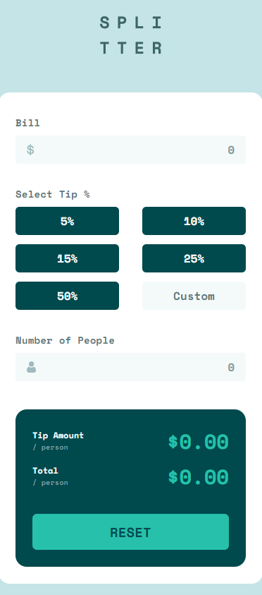

# Tip Calculator App

*Caption: Desktop view of the Tip Calculator App*

*Caption: Mobile view of the Tip Calculator App*

I created an **Tip Calculator App** as part of the [Frontend Mentor](https://www.frontendmentor.io/challenges/tip-calculator-app-ugJNGbJUX) challenge. This projects is a user-friendly tool designed to split the bill. Whether you're dining out with friends or organizing shared expenses, this app provides accurate results and ensures everyone pays their fair share. Simply enter the bill amount, the number of people splitting the bill, and choose the tip percentage. The app will instantly display the tip per person and the total amount, including the tip, making it easy to settle the bill.

## Link

You can see a live demo of the **Tip Calculator App** [here](https://lawrpunk.github.io/tip-calculator-app/).

## Features

- Responsive design for any screen size.
- Handles situations where users forget to input necessary values.
- Accurate calculation.
- Interactive elements.

## Technologies Used

- HTML
- CSS
- JavaScript

## Acknowledgments

- [Frontend Mentor](https://www.frontendmentor.io/) for the challenge
